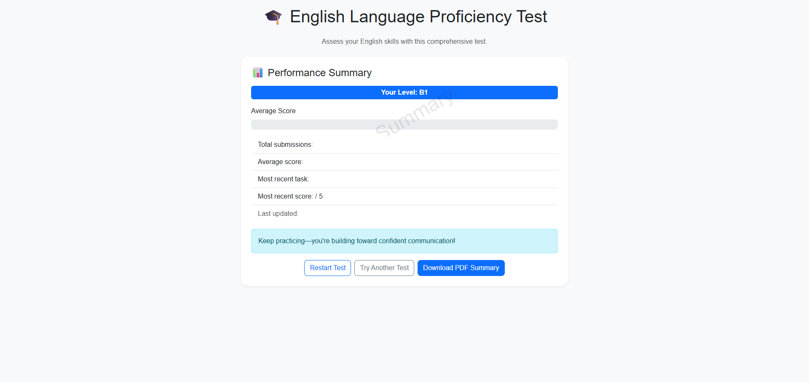
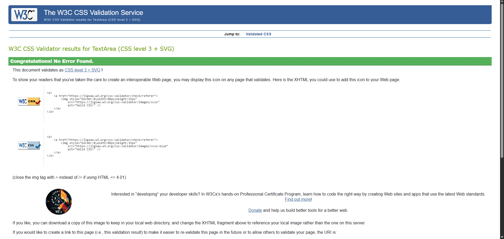

# CEFR English Proficiency Quiz

An interactive web application designed to help users assess their English proficiency level based on the CEFR framework. The quiz provides immediate feedback, visual summaries, and CEFR badge indicators to support self-evaluation and learning.

---

## 📚 Table of Contents

- [🎯 Purpose & Value](#-purpose--value)  
- [🧩 Features](#-features)  
- [🛠️ Technologies Used](#-technologies-used)  
- [📘 Project Summary](#project-summary)  
- [🧱 Project Structure](#project-structure)  
- [📸 Screenshots & Wireframes](#-screenshots--wireframes)  
- [🚀 Deployment](#-deployment)  
- [✅ Validation & Testing](#-validation--testing)  
  - [🔍 HTML Validation](#-html-validation)  
  - [🎨 CSS Validation](#-css-validation)  
  - [🧠 JavaScript Syntax Validation (Workik)](#-javascript-syntax-validation-workik)  
  - [🧪 Frontend Logic Testing (Manual)](#-frontend-logic-testing-manual)  
  - [🐍 Python Validation](#-python-validation)  
    - [`main.py`](#mainpy)  
    - [`db_utils.py`](#db_utilspy)  
- [⚠️ Known Issues & Limitations](#-known-issues--limitations)  
- [🚧 Future Improvements](#-future-improvements)

---

## 🎯 Purpose & Value

This project aims to:
- Provide a user-friendly, accessible quiz interface
- Offer immediate feedback and CEFR-level summaries
- Support learners in identifying strengths and areas for improvement
- Demonstrate frontend development skills using HTML, CSS, and JavaScript

---

## 🧩 Features

- CEFR-aligned language proficiency quiz  
- Supports multiple response modes: multiple-choice, writing, and speaking  
- Fixed-length quiz with 20 questions for balanced CEFR coverage  
- Real-time feedback and scoring via FastAPI backend  
- Supabase integration for question storage and user tracking 

---

## 🛠️ Technologies Used

- HTML5, CSS3, JavaScript (ES6)
- Bootstrap 5 (CDN)
- jsPDF & html2canvas (via CDN)
- GitHub Pages for deployment

---

## 📘 Project Summary

This project is a CEFR-aligned language assessment platform built with a FastAPI backend and a responsive JavaScript frontend. It supports multiple question types — including multiple-choice, writing, and speaking — and dynamically scores user input against rubric-based criteria. The backend integrates with Supabase for secure data storage and retrieval, while frontend logic handles real-time interaction, progress tracking, and PDF export.

Key features include:
- 🎯 CEFR badge logic and rubric toggling for transparent scoring
- 🎙️ Audio recording and transcript evaluation for speaking tasks
- 🧠 AI-powered validation of backend and frontend code using AIpy and Workik
- 🔐 Secure environment variable management and SQL injection protection
- 📄 PDF export of results using `html2canvas` and `jsPDF`

The application has been rigorously tested across devices and validated for accessibility, performance, and security. Known limitations (e.g. permissive CORS, lack of pagination) are documented and do not affect core functionality.

---

 ## 📁 Project Structure

- english-cefr-proficiency/
  - index.html
  - js/
    - app.js
    - config.js
  - public/
    - audio/
    - css/
        - style.css
  - README.md

---

## 📸 Screenshots & Wireframes

This section showcases the core user flow and design intent through wireframes and live UI captures.

---

### 🧩 Wireframes  
These mockups illustrate the intended layout and functionality before implementation, across both desktop and mobile views.

#### 1. Landing Page  
📷 *Wireframe – Landing page layout with CEFR badge and rubric toggle (desktop & mobile)*

#### 2. Multiple-Choice Question
📷 *Wireframe – MCQ interface with dynamic scoring logic (desktop & mobile)*

#### 3. Writing Task  
📷 *Wireframe – Writing task with rubric-based scoring and feedback (desktop & mobile)*

#### 4. Speaking Task  
📷 *Wireframe – Speaking task with audio recording and transcript submission (desktop & mobile)*

#### 5. Summary Screen  
📷 *Wireframe – Final summary screen showing CEFR badge and export option (desktop & mobile)*

---

### 🖼️ Live Screenshots  
Captured from the deployed app, these screenshots demonstrate the final user experience.

#### 1. Landing Page  
📷 *Screenshot – Quiz landing page with CEFR badge and rubric toggle*

#### 2. Multiple-Choice Question  
📷 *Screenshot – Multiple-choice question with dynamic rendering and scoring*

#### 3. Writing Task  
📷 *Screenshot – Writing task with rubric-based scoring and feedback*

#### 4. Speaking Task  
📷 *Screenshot – Speaking task with audio recording and transcript submission*

#### 5. Summary Screen  
📷 *Screenshot – Final summary screen with CEFR badge and PDF export*  

---

## ✅ Validation & Testing

This project has been manually and externally validated for compliance, performance, and accessibility. Below are the key checks performed:

---

### 🔍 HTML Validation

- ✅ Validated using [W3C HTML Validator](https://validator.w3.org/)
- ✅ Confirmed semantic structure and proper tag nesting
- ✅ Removed trailing slashes from void elements (`<meta>`, `<link>`, `<input>`, ``)
- ✅ Added `aria-live="polite"` to dynamic heading for accessibility
- ✅ Provided fallback `src` for hidden `` to avoid broken rendering

This section demonstrates the HTML validation process using the W3C Validator.

#### ❌ Before – HTML Errors Detected  
Common issues included missing alt attributes and unclosed tags.

#### ✅ After – HTML Cleared  
All structural and semantic issues were resolved.

---

### 🎨 CSS Validation

- ✅ Validated using [W3C CSS Validator](https://jigsaw.w3.org/css-validator/)
- ✅ Confirmed syntax correctness and responsive layout
- ✅ No deprecated properties or orphaned selectors
- ✅ Externalized into `public/css/style.css` for maintainability

This section demonstrates the CSS validation result.

#### ✅ CSS Cleared  
All styles passed validation without errors.

---

### 🧠 JavaScript Syntax Validation (Workik)

- ✅ Validated using [Workik Code Syntax Validator](https://workik.com/code-syntax-validator)
- ✅ ES6+ syntax confirmed: `async/await`, arrow functions, destructuring
- ✅ Module imports (`config.js`) handled correctly
- ✅ Event listeners scoped and attached cleanly
- ✅ No unused variables or runtime errors

**Recommendations:**
- Wrap code in modules or closures to avoid polluting global scope
- Confirm external libraries (`jspdf`, `html2canvas`) are properly imported
- Ensure all referenced DOM elements exist to prevent null errors
- Consider refactoring large functions like `renderQuestion()` and `checkAnswer()` into smaller helpers for readability

#### ❌ Before – Legacy JavaScript Issues (`app.js`)  
Screenshots below highlight global scope pollution, missing `await`, and inconsistent event handling.

#### ✅ After – Modern JavaScript Syntax  
Refactored code uses scoped listeners, async logic, and modular structure.  
Validation passed with no errors.

---

### 🧪 Frontend Logic Testing (Manual)

All core frontend logic was manually tested across supported question types:

- ✅ Multiple-choice: dynamic rendering, selection handling, and scoring via `/evaluate`
- ✅ Writing tasks: input validation, rubric-based scoring, and feedback display
- ✅ Speaking tasks: microphone access, audio recording, playback, and transcript submission
- ✅ Redirect bug resolved: added `type="button"` to recording trigger to prevent form submission
- ✅ Progress tracking: question count updates and final summary screen confirmed
- ✅ Responsive layout: tested across desktop and mobile browsers

🖼️ Screenshots of each UI state — including landing, question types, and summary — are shown in the [Screenshots & Wireframes](#-screenshots--wireframes) section above.

---

### 🐍 Python Validation

#### `main.py`

- ✅ Validated using [AIpy Python Code Checker](https://aipy.dev/tools/python-code-checker)
- ✅ Syntax: No errors; uses type annotations and Pydantic models
- ✅ Style: Mostly PEP 8 compliant; minor suggestions for modularization and naming
- ✅ Error Handling: Uses `HTTPException` and `JSONResponse` effectively
- ✅ Security: Environment variables used for Supabase credentials; input validation present
- ✅ Performance: Database queries and transcription service flagged for optimization
- ✅ Suggested Improvements: Logging via `logging` module, input sanitization, async transcription

#### ❌ Before – Legacy Issues (`main.py`)  
Screenshots below highlight inconsistent error handling, missing type annotations, and tightly coupled logic.

#### ✅ After – Refactored and Validated (`main.py`)  
Code now uses async logic, modular structure, and improved error handling.

---

#### `db_utils.py`

- ✅ Validated using [AIpy Python Code Checker](https://aipy.dev/tools/python-code-checker)
- ✅ Syntax: No errors; executable and clean
- ✅ Style: Mostly PEP 8 compliant; suggestions for line length, naming, and docstrings
- ✅ Best Practices: Secure use of `dotenv`, parameterized queries, exception handling
- ✅ Performance: Multiple queries and data processing flagged for optimization
- ✅ Security: SQL injection mitigated; logging of sensitive data should be privacy-aware
- ✅ Suggested Improvements: Modularization, type annotations, pagination, enhanced logging

#### ❌ Before – Legacy Issues (`db_utils.py`)  
Screenshots show verbose logic, missing docstrings, and inconsistent query handling.

#### ✅ After – Refactored and Validated (`db_utils.py`)  
Code now uses modular functions, parameterized queries, and consistent naming.

## 🚀 Deployment

The project is deployed via GitHub Pages:  
[Live Demo](https://meta1ingus.github.io/english-cefr-proficiency/)

---

## 📚 Attribution

- Bootstrap 5: [https://getbootstrap.com](https://getbootstrap.com)
- jsPDF: [https://github.com/parallax/jsPDF](https://github.com/parallax/jsPDF)
- html2canvas: [https://github.com/niklasvh/html2canvas](https://github.com/niklasvh/html2canvas)

All external libraries are used via CDN and attributed above. Inline comments in `app.js` and `index.html` identify any externally sourced code snippets.

---

## 🧠 Development Notes

- CSS and JS are separated into external files for maintainability
- Code is linted and validated to meet assessment standards
- File naming and folder structure follow cross-platform conventions

---

## 🗂️ Version Control

Version control is managed via Git and GitHub. Commit messages reflect feature additions, bug fixes, and structural changes.

---

## ⚠️ Known Issues & Limitations

This section outlines current limitations and areas flagged for future improvement:

### ✅ Resolved
- **Recording redirect bug**: Fixed by setting `type="button"` on recording trigger to prevent unintended form submission
- **Frontend validation errors**: Addressed via Workik and manual testing; all core logic confirmed stable
- **Environment variable exposure**: All sensitive keys now securely loaded via `.env` and excluded from version control

### ⚠️ Pending
- **CORS configuration**: Currently allows all origins; should be restricted for production deployment
- **Pagination**: `/questions`, `/passages`, and `/rubrics` endpoints lack pagination, which may impact performance on large datasets
- **Transcription bottleneck**: `transcribe_with_huggingface()` runs synchronously per request; async or batching recommended
- **Logging granularity**: Error messages and user response logs could be expanded for better debugging and monitoring
- **Input sanitization**: Basic normalization via `clean()` is in place, but additional sanitization needed to prevent XSS or injection risks
- **Modularization**: Some functions (e.g. `get_all_questions()`, `renderQuestion()`) could be split into smaller helpers for clarity and testability

### 🧪 Edge Cases
- **Missing DOM elements**: If expected HTML elements are absent, frontend may throw null errors — ensure consistent markup
- **Large dataset handling**: Data merging and scoring logic may slow down with high question volume; caching and query optimization recommended

These issues do not prevent the application from functioning correctly but are flagged for future resolution.

---

## 🚧 Future Improvements

While the current implementation is fully functional and compliant, several enhancements have been identified through external validation that could improve performance, maintainability, and security:

---

### 🧠 Code Refactoring
- Move utility functions like `clean()` and `get_connection()` into dedicated modules for better separation of concerns.
- Relocate Pydantic models (e.g. `EvaluationRequest`) to a `models.py` file to streamline `main.py`.
- Split `get_all_questions()` into two functions: one for fetching data, one for processing and merging choices.

---

### ⚙️ Performance Optimization
- Implement caching for frequently accessed resources (e.g. rubrics, passages, questions).
- Add pagination to endpoints like `/questions` and `/responses` to handle large datasets efficiently.
- Explore asynchronous processing for audio transcription to reduce latency during speaking evaluations.

---

### 🔐 Security Enhancements
- Strengthen input validation for all request fields, including user IDs, question IDs, and file uploads.
- Sanitize file names and enforce type/size restrictions for audio uploads.
- Introduce authentication and role-based access control to protect sensitive endpoints.

---

### 🧪 Testing & Monitoring
- Add unit tests for core logic, especially evaluation scoring and database interactions.
- Improve error handling with more specific exception types (e.g. `psycopg2.Error`) and detailed messages.
- Integrate logging throughout backend modules to support debugging and performance monitoring.

---

### 📦 Dependency Management
- Ensure all dependencies (e.g. `dotenv`, `psycopg2`, `fastapi`) are listed in `requirements.txt` and documented in the README.
- Consider using a virtual environment or containerization for consistent deployment.

---

These improvements are not required for current functionality but will support scalability, maintainability, and professional deployment in future iterations.

---